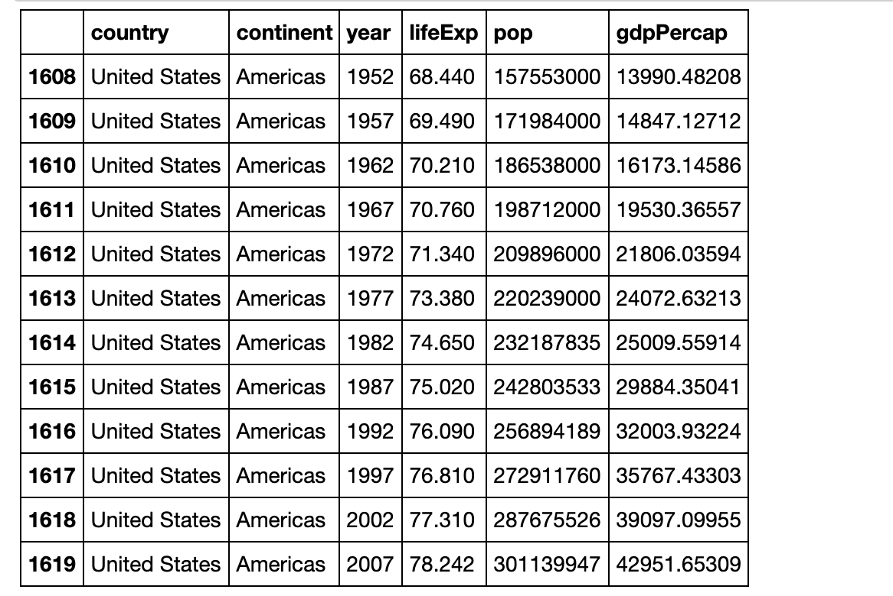
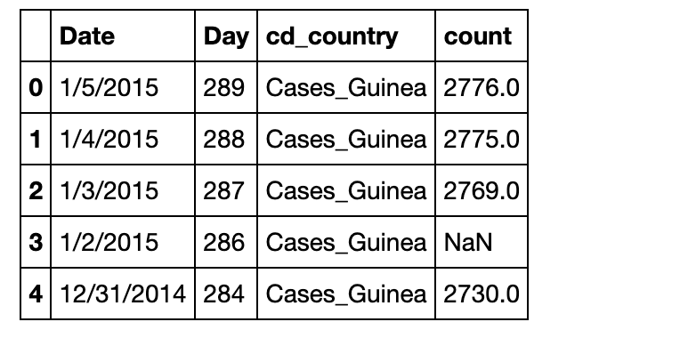
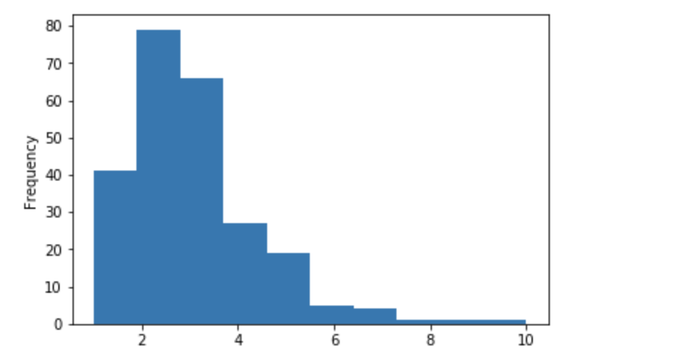
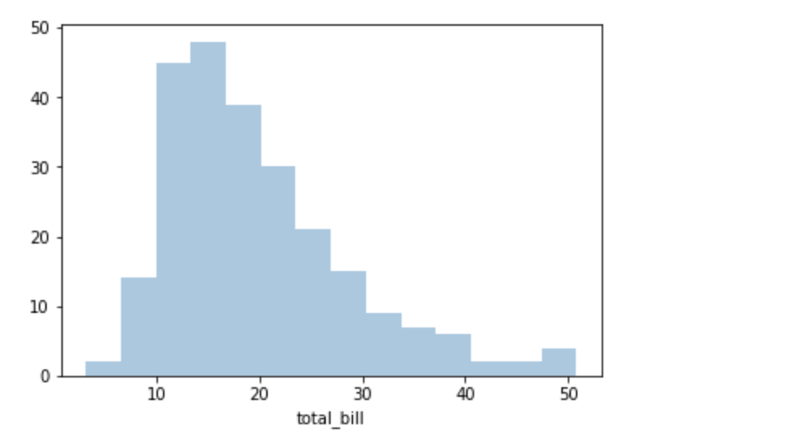
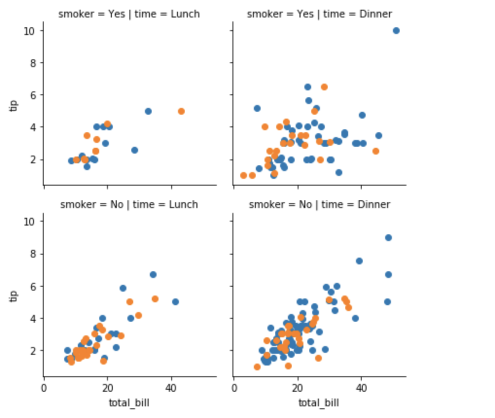
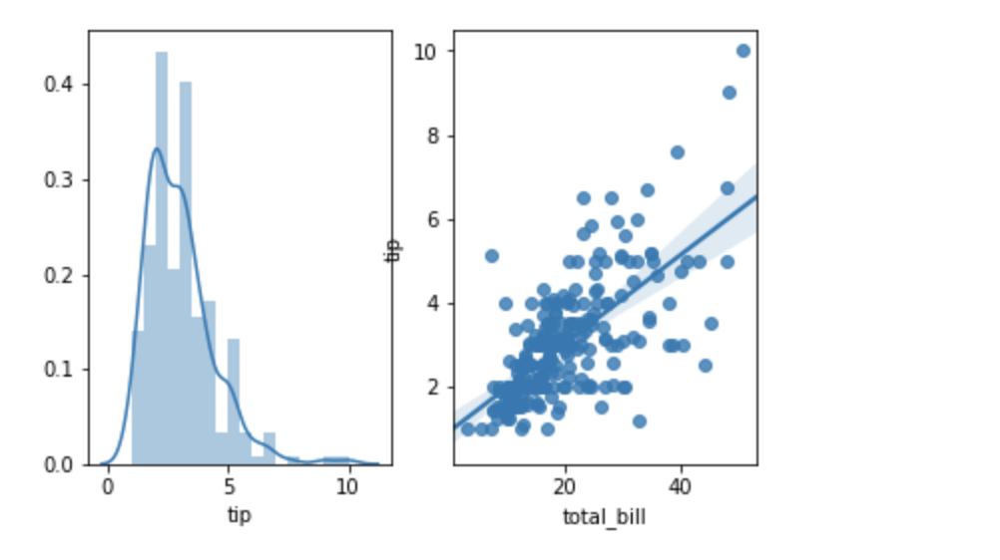
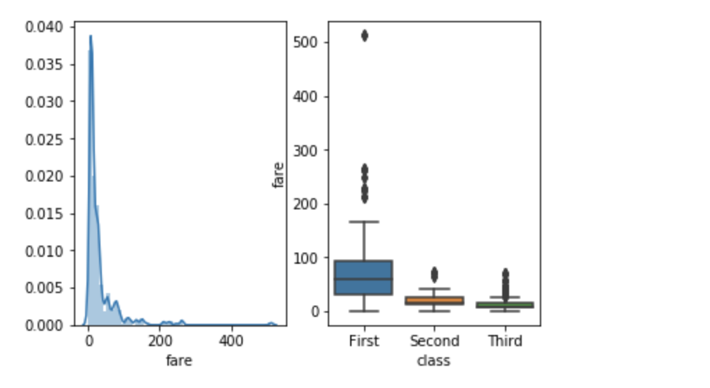

# Python-Data-Analysis
This repo contains the files which implement the basic Data filtering/analysis techniques using the various python based libraries like Pandas, Numpy, Seaborn, Numba etc.

